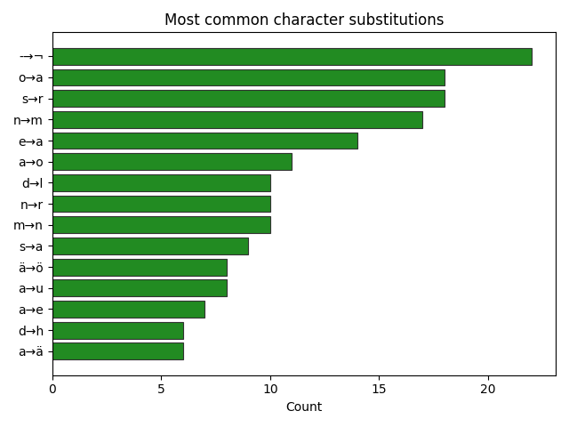

# HTR evaluation

## What and why
This repo sets up a pipeline for inference and evaluation of one htr-pipeline on unseen handwritten pages from the late 1800s. The purpose is to set up an inference pipeline to gather some informative metrics of model performance.
The model is evaluated on a tiny dataset (10 pages) but could easily be expanded if needed and results are presented below.

### Models
The models used are all the most recent models released by Riksarkivet (available for use with HTR-flow).
yolov9-regions
yolov9-lines-in-regions
trocr-base-handwritten-hist-swe-2
All models are used as-is, without additional training or fine-tuning.

## Environment setup

The project uses two separate Python environments due to differing
dependency requirements (when running on CPU):

- `requirements_yolo.txt` for region and line detection
- `requirements_trocr.txt` for TrOCR inference

### Data
Handwritten text from four different swedish writers between 1898-1900.
The dataset has been selected with regard to som different factors: not having been seen by the model
during training, quality of images, and being open data. The goldstandard was created carefully and manually by yours truly and may contain errors.
# TODO
With access to more comparable data (for example from a specific domain) could be added for comparing metrics in the future.

## Evaluation
The models performance is evaluated using WER and CER, as well as more detailed metrics.
Manual examination of selected error cases will also be performed ad visualised.

### Metrics
- WER

- CER

- length-ratio

- switched characters

- switched words

WER and CER are computed at page level, as only page-level gold transcriptions were available. Fore a more finegrained result metrics would need to be calculated per line instead.


### Results

````
CER: 0.07993562231759657
WER: 0.21537086684539766
````




## Limitations
No new models were trained as part of this project due to the focus on inference and evaluation rather than model development.
